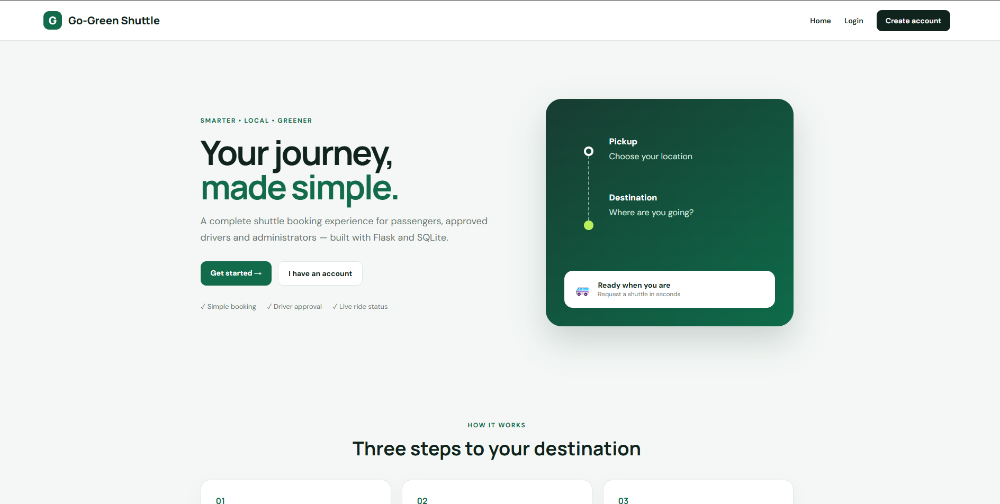
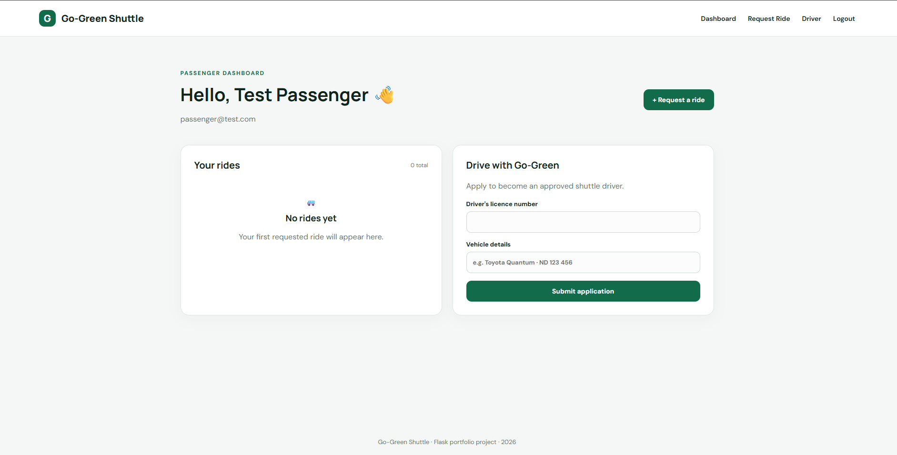
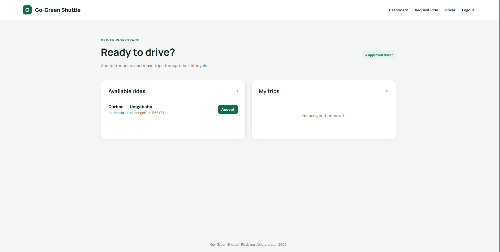
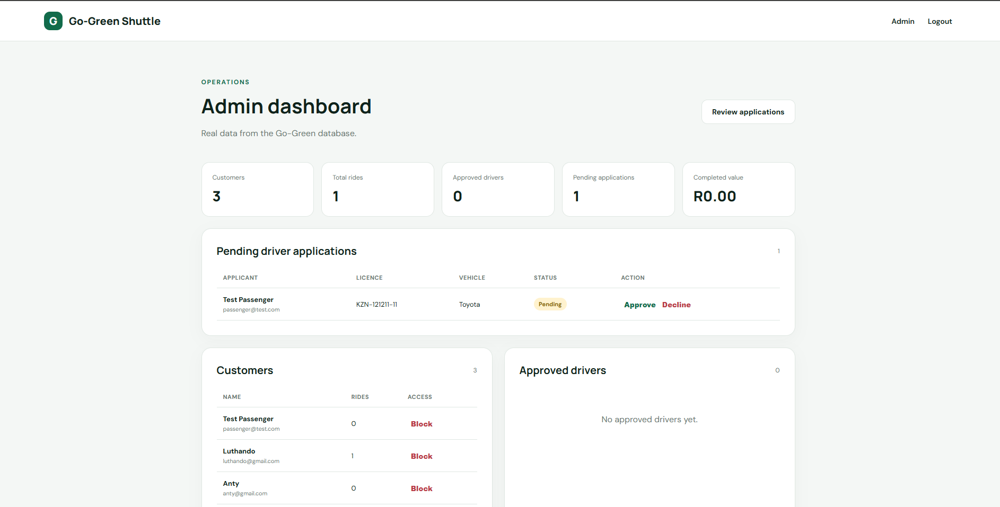

# Go-Green Shuttle Service 🚐🌱

A full-stack shuttle booking and ride-management web application built with **Python, Flask and PostgreSQL**.

Passengers can create accounts and request rides, users can apply to become drivers, administrators can review driver applications and manage customers, and approved drivers can accept, start and complete trips.

## 🌐 Live Demo

The application is deployed on Render:

https://go-green-shuttle-service-xmxj.onrender.com/

> The hosted service may take a short time to start after a period of inactivity.

---

## 📸 Application Screenshots

### Home Page

The public landing page introduces the Go-Green Shuttle Service and provides access to passenger registration and login.



### Passenger Dashboard

Registered passengers can request shuttle rides, view their bookings and monitor the status of their trips.



### Driver Dashboard

Approved drivers can view available ride requests, accept trips and manage rides through the ride lifecycle.



### Admin Dashboard

Administrators can review driver applications, manage customers and monitor live ride and platform statistics.



---

## ✨ What the Project Demonstrates

- Passenger registration, login and session authentication
- Ride requests with passenger count, fare estimate and payment preference
- Ride lifecycle: `requested → accepted → in_progress → completed`
- Driver applications with administrator approval/decline workflow
- Approved-driver dashboard with available and assigned trips
- Passenger ride history and cancellation
- Admin dashboard with live database statistics
- Customer block/unblock controls
- PostgreSQL production database
- bcrypt password hashing
- Environment-based secrets and configuration
- Gunicorn production server
- Deployment on Render
- Responsive Flask/Jinja2 interface
- Git and GitHub version control

---

## 🛠️ Tech Stack

| Area | Technology |
|---|---|
| Backend | Python, Flask |
| Frontend | HTML, Jinja2, CSS |
| Production Database | PostgreSQL |
| Local Development | SQLite-compatible database layer |
| Authentication | Flask sessions |
| Password Security | bcrypt |
| Production Server | Gunicorn |
| Deployment | Render |
| Version Control | Git & GitHub |

---

## 🚀 Quick Start

### 1. Clone the Repository

```bash
git clone https://github.com/MlungisiMnembe/GO-GREEN-Shuttle-Service.git
cd GO-GREEN-Shuttle-Service
```

### 2. Create a Virtual Environment

```bash
python -m venv .venv
```

### 3. Activate the Virtual Environment

#### Windows PowerShell

```powershell
.\.venv\Scripts\Activate.ps1
```

### 4. Install Dependencies

```powershell
pip install -r requirements.txt
```

### 5. Configure Environment Variables

Use `.env.example` as the template for your local environment configuration.

Create a `.env` file and configure your own secure values for the required environment variables.

Important:

- Never commit `.env`
- Use a strong, unique `SECRET_KEY`
- Use private administrator credentials
- Configure `DATABASE_URL` when connecting to PostgreSQL
- Production secrets should be configured through the hosting environment

### 6. Start the Application

```powershell
python app.py
```

Then open:

```text
http://127.0.0.1:5000
```

---

## ⚙️ Environment Configuration

The application uses environment variables for sensitive configuration.

The `.env.example` file provides the required configuration structure without exposing real credentials.

Typical configuration includes:

```text
SECRET_KEY=your-secret-key
ADMIN_EMAIL=your-admin-email
ADMIN_PASSWORD=your-secure-admin-password
DATABASE_URL=your-database-connection-url
```

Production credentials and database connection information should never be committed to the repository.

---

## 👤 Application Workflow

### Passenger

1. Create an account.
2. Log in.
3. Request a shuttle ride.
4. Select the passenger count and payment preference.
5. View current and previous rides.
6. Cancel eligible ride requests.
7. Monitor the ride through its lifecycle.

### Driver

1. Create an account.
2. Submit a driver application.
3. Wait for administrator approval.
4. Open the Driver dashboard after approval.
5. View available rides.
6. Accept a ride.
7. Start the assigned trip.
8. Complete the trip.

### Administrator

1. Log in using securely configured administrator credentials.
2. Review pending driver applications.
3. Approve or decline applications.
4. View registered customers.
5. Block or unblock customer access.
6. View approved drivers.
7. Monitor ride statistics.
8. Monitor completed ride value.

---

## 🔄 Ride Lifecycle

A ride moves through the following stages:

```text
Requested
    ↓
Accepted
    ↓
In Progress
    ↓
Completed
```

This workflow allows passengers, drivers and administrators to interact with the same ride data according to their roles.

---

## 🧪 End-to-End Testing

The deployed application has been tested through the complete workflow:

1. Passenger account creation and login
2. Ride request creation
3. Driver account creation and application
4. Administrator approval
5. Driver login and ride acceptance
6. Ride start
7. Ride completion
8. Passenger ride-history verification
9. Administrator statistics verification

This confirms that the core application workflow operates against the deployed PostgreSQL database.

---

## 📁 Project Structure

```text
GO-GREEN-Shuttle-Service/
│
├── app.py
├── database.py
├── requirements.txt
├── .python-version
├── .env.example
├── .gitignore
├── README.md
│
├── screenshots/
│   ├── home.png
│   ├── passenger-dashboard.png
│   ├── driver-dashboard.png
│   └── admin-dashboard.png
│
├── static/
│   └── base-style.css
│
└── templates/
    ├── base.html
    ├── index.html
    ├── login.html
    ├── signup.html
    ├── user_dashboard.html
    ├── driver_dashboard.html
    ├── ride_request.html
    ├── admin.html
    └── pending_requests.html
```

---

## 🗄️ Database

The deployed application uses **PostgreSQL** for persistent production data.

The database layer supports:

- User accounts
- Driver applications
- Ride requests
- Ride assignments
- Ride status lifecycle
- Administrative statistics
- Customer access controls

The project was originally developed using SQLite and was subsequently adapted to support PostgreSQL for production deployment.

This provides a lightweight local development setup while allowing the deployed application to use a production database.

---

## 🌍 Deployment Architecture

The production application is hosted on Render.

```text
User Browser
     ↓
Render Web Service
     ↓
Gunicorn
     ↓
Flask Application
     ↓
PostgreSQL Database
```

The Render web service runs the Flask application through Gunicorn.

Updates pushed to the configured GitHub branch can be automatically deployed to the hosted application.

---

## 🔐 Security

The project implements several basic application security practices:

- Passwords are hashed using bcrypt
- Application secrets are stored in environment variables
- `.env` is excluded from version control
- Production administrator credentials are not stored in the repository
- Database credentials are supplied through environment configuration
- Session-based authentication protects restricted areas
- Administrator-only functionality is separated from normal user functionality
- Driver functionality is restricted according to application approval status

---

## 💰 Demo Fare Calculation

The current fare calculation uses a transparent demonstration formula:

```text
R45 + R20 per passenger
```

This allows the complete booking workflow to operate without requiring paid mapping or geocoding services.

A production version could replace this with distance-based pricing using a mapping service.

---

## 💳 Payments

Card payment is currently represented as a **payment preference** for demonstration purposes.

No real payment processor is currently connected, and the application does not process real card transactions.

A production version could integrate a payment provider and securely process online payments.

---

## 🗺️ Mapping

The core booking workflow does not depend on a paid mapping or geocoding service.

This keeps the portfolio project easy to run locally and deploy without external mapping credentials.

A future version could integrate services such as Google Maps or Mapbox for:

- Address autocomplete
- Route visualization
- Distance calculation
- Estimated travel time
- Distance-based fares
- Driver navigation

---

## 🔮 Future Enhancements

Possible future improvements include:

- Google Maps or Mapbox routing
- Address autocomplete and geocoding
- Distance-based fare calculation
- Live driver location tracking
- Real online payment processing
- Email notifications
- SMS notifications
- Passenger ride-status notifications
- CSRF protection
- Formal database migrations
- Automated unit tests
- Integration tests
- CI/CD testing with GitHub Actions
- Improved role-based access control
- REST API endpoints
- Better administrative reporting
- Driver availability controls
- Ride search and filtering
- Mobile-friendly Progressive Web App functionality

---

## 🎯 Project Purpose

Go-Green Shuttle Service was developed as a practical full-stack portfolio project demonstrating how a web application can combine:

- Frontend interfaces
- Backend business logic
- Authentication
- Role-based workflows
- Database persistence
- Production configuration
- Cloud deployment
- Version control

The project demonstrates the development lifecycle from local development through database migration, testing and production deployment.

---

## 🔗 Links

**Live Application**

https://go-green-shuttle-service-xmxj.onrender.com/

**GitHub Repository**

https://github.com/MlungisiMnembe/GO-GREEN-Shuttle-Service

---

## 👨‍💻 Author

**Mlungisi Mnembe**

GitHub: https://github.com/MlungisiMnembe

---

Built as a practical full-stack Flask portfolio project using **Python, Flask, PostgreSQL, Gunicorn and Render**.